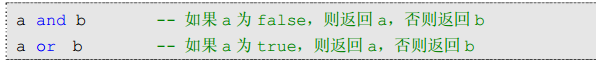
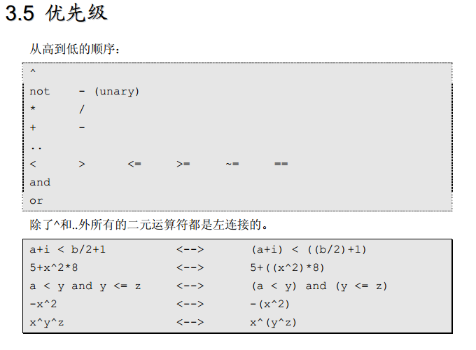

<meta http-equiv="Content-Type" content="text/html; charset=utf-8">

所以 Lua 认为 0 和空串都是真

print(12 .. 00)
120

..是连接字符 将2个字符串连接

连接前先将数字转成字符 12-->12  00-->0
连接起来就是120

#

#######
>数组下标可以根据需要，从任意值开始。
>
>然而习惯上， Lua 的下标从 1 开始。 Lua 的标准库遵循此惯例，因此你的数组下标必须也是从 1 开始，才可以使用标准库的函数

